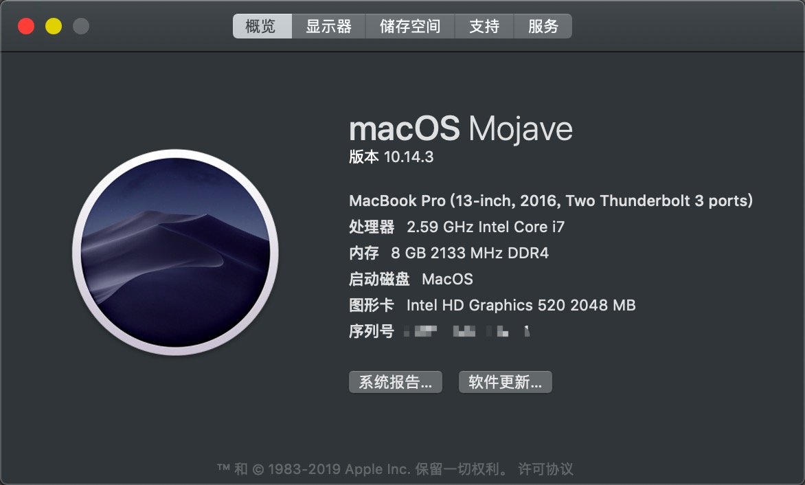
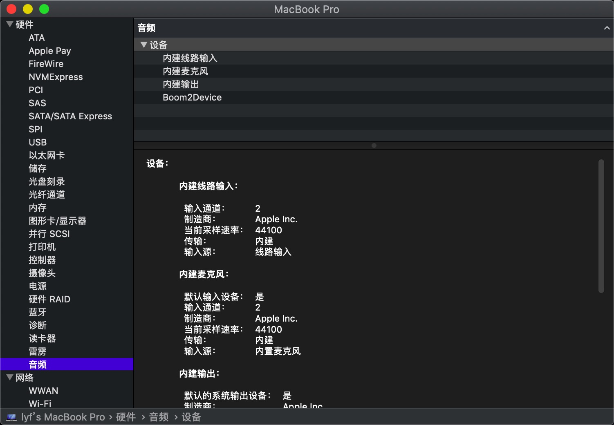
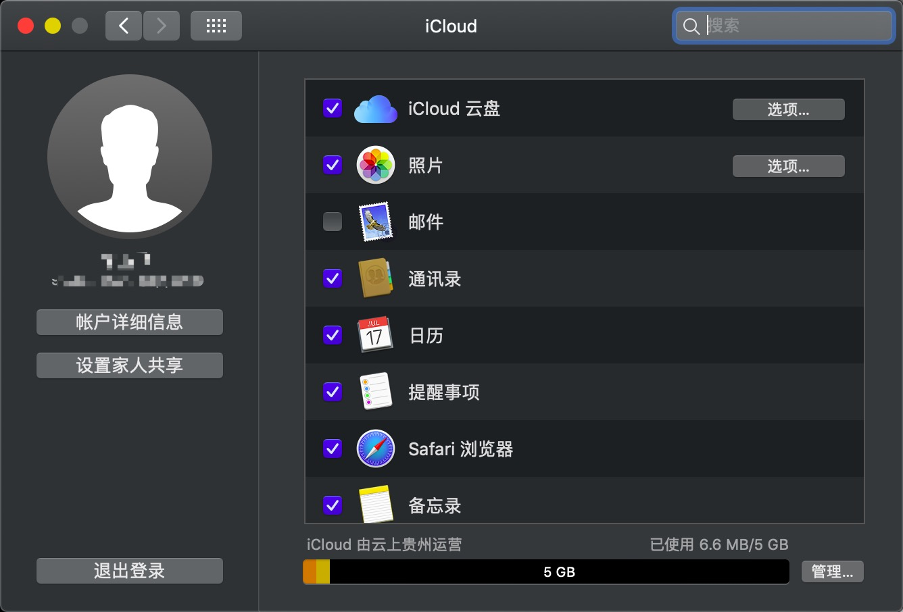

# 黑苹果 Ideapad-310-ISK (又名联想小新310)

efi较完美，无线网卡无解(充钱能解决 )，睡眠、电池、cpu变频、集显驱动正常

## 截图

从10.13.2版本到10.14.3版本一直用着，但是老版本的EFI没有了

## 硬件列表

* CPU: Intel: i7-6500U
* GPU: 独立显卡已屏蔽，集显HD520正常驱动
* 内存: 8G 2133DDR4
* 声卡: 全称忘了, 但是已经仿冒AppleALC, 正常驱动
* 有线网卡: 正常
* 蓝牙：正常(和wifi是一块板子，但是蓝牙能驱动)
* 硬盘：自带三星SSD 128 G +  1T自装机械

## 正常工作

* CPU
* HD520
* 声卡已注入
* 有线网卡正常(无线网卡无解)
* 电池电量显示正常